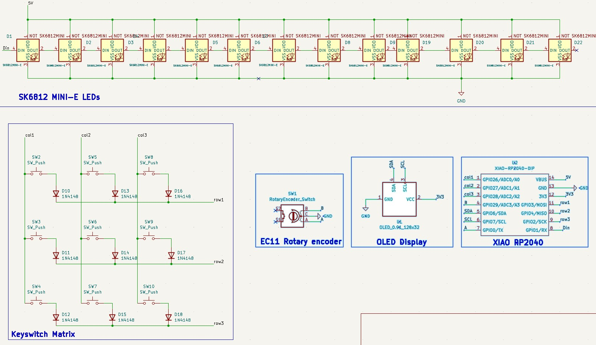
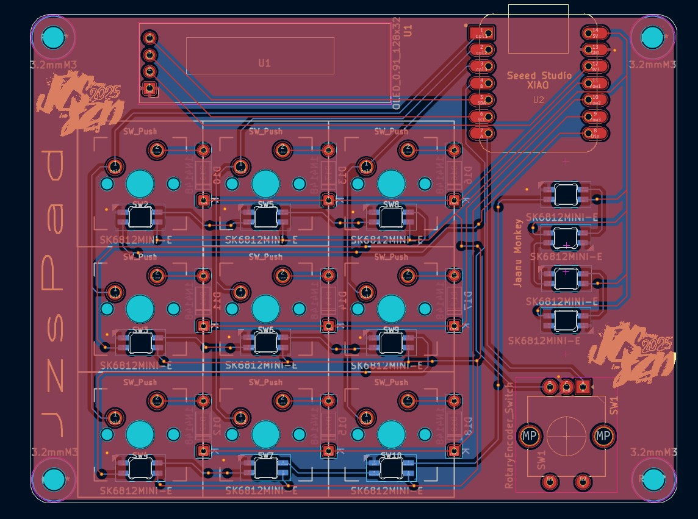
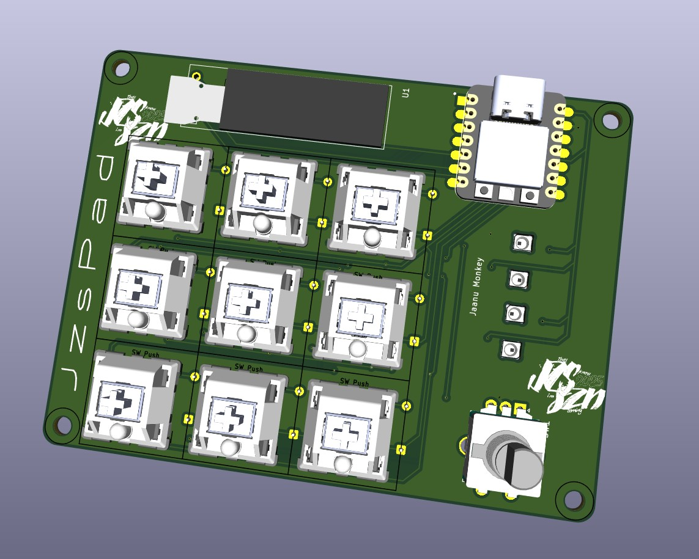
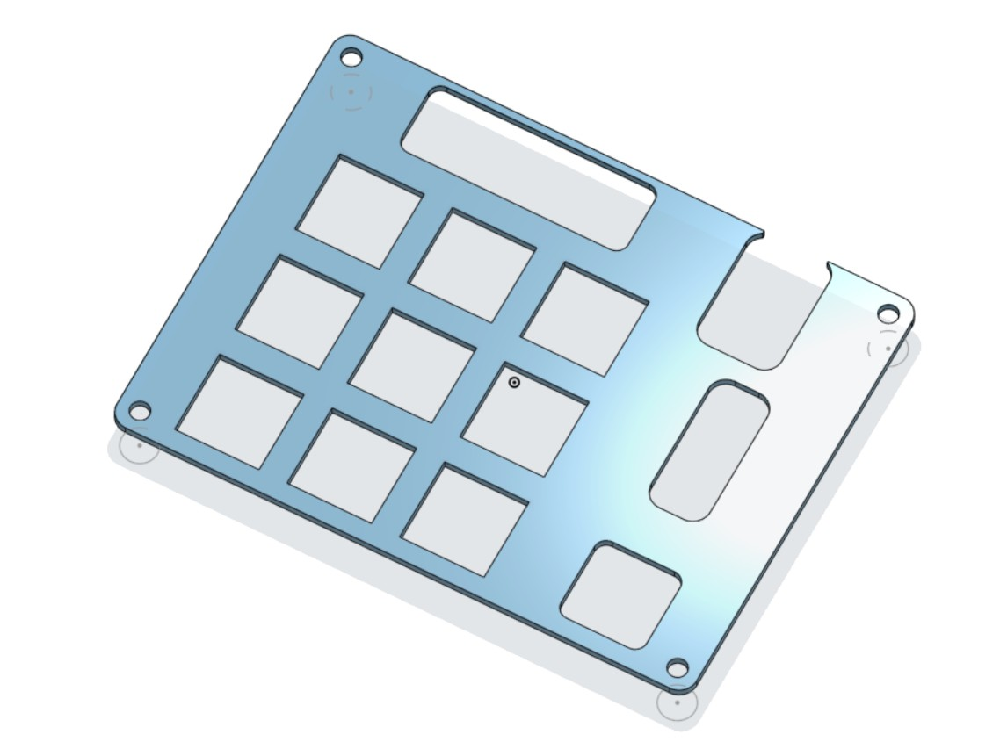
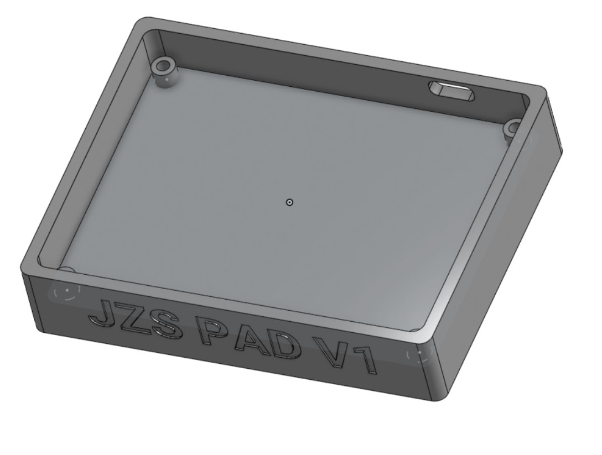
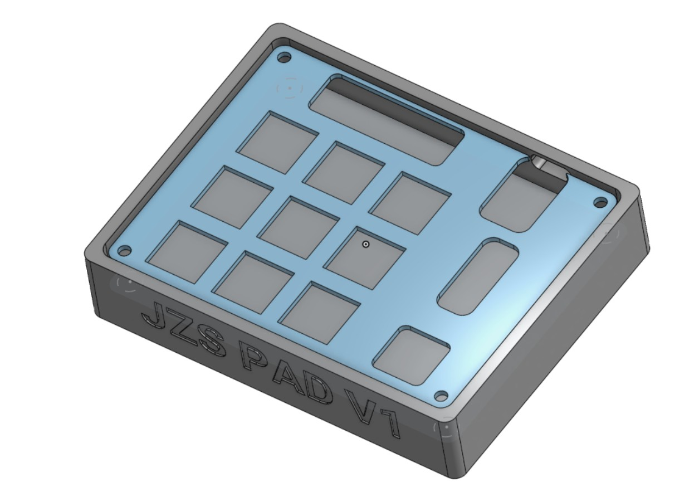
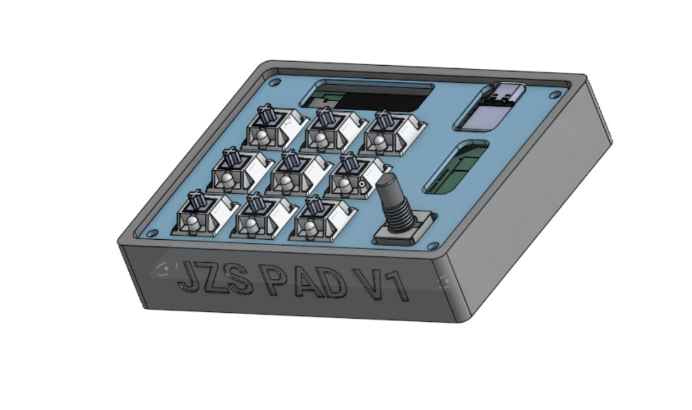

# Custom Multi-Purpose Macropad (jzspad)

A multi-purpose macropad featuring 9 customizable LED-backlit keys, 1 rotary encoder, and an OLED display. Powered by the Seeed Studio XIAO RP2040, The keys change depending on the program, but for now they are copy, paste, undo, mute, cam off, close tab, play / pause, screenshot, and most important- show Desktop :)

## 🛠️ Hardware & PCB Design
## SCHEMATIC

The schematic was designed using KiCad all peripherals (OLED, LEDs, Encoder, Matrix) fit perfectly within the 11 available GPIO pins.

## PCB LAYOUT

Designed at a precise 98mm x 75mm, staying  Under the 100x100mm threshold.

## PCB 3D

## 📦 Mechanical Design (3D Case)
## PLATE MODEL

## BOTTOM CASE MODEL

## JZS PAD CAD MODEL

The custom enclosure was modeled in **Onshape**. It features snap-fit or screw-mounted standoffs designed perfectly for the custom PCB layout and keycaps.

## JZS PAD CAD AND PCB MODEL

## ✨ Features
* **Microcontroller:** Seeed Studio XIAO RP2040
* **Inputs:** 3x3 Key Matrix (9 Keys) + 1 Rotary Encoder (Volume/Scroll)
* **Visuals:** 128x32 I2C OLED Display for real-time dynamic status updates
* **Lighting:** 13 SK6812MINI-E RGB LEDs 
* **Firmware:** Event-driven KMK framework (CircuitPython)

### 🛒 Bill of Materials (Hardware Needed)
* **9x** MX-Solderable-1U Switches
* **9x** DSA Keycaps
* **4x** M3x5x4 Heatset inserts
* **4x** M3x16mm screws
* **9x** 1N4148 DO-35 Diodes
* **13x** MX_SK6812MINI-E_REV LEDs
* **1x** 0.91" 128x32 OLED Display
* **1x** EC11 Rotary Encoder
* **1x** Seeed Studio XIAO RP2040
* **1x** 3D Printed Case + 1 3D Printed Plate

---

### Extra stuff
**JZS SZN 2025 THEY KNOW IM COMING**

## 📄 License
This project is open-source and available under the **MIT License**.
